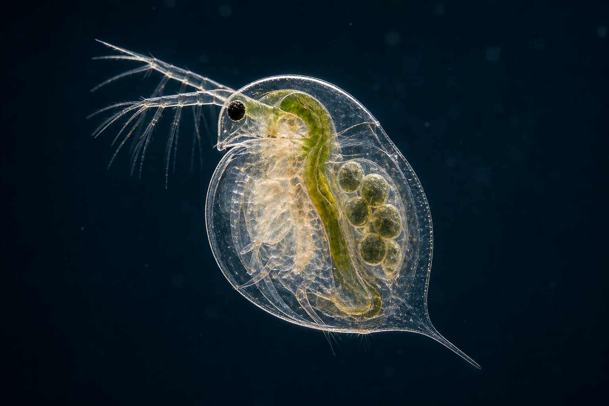
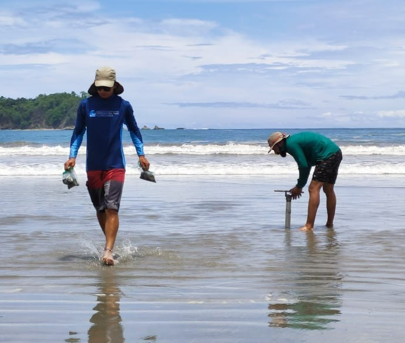
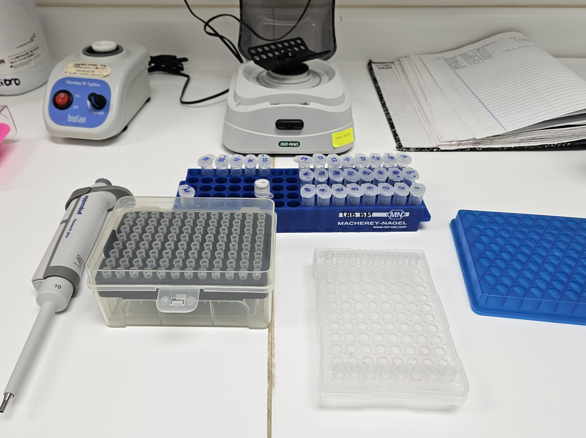
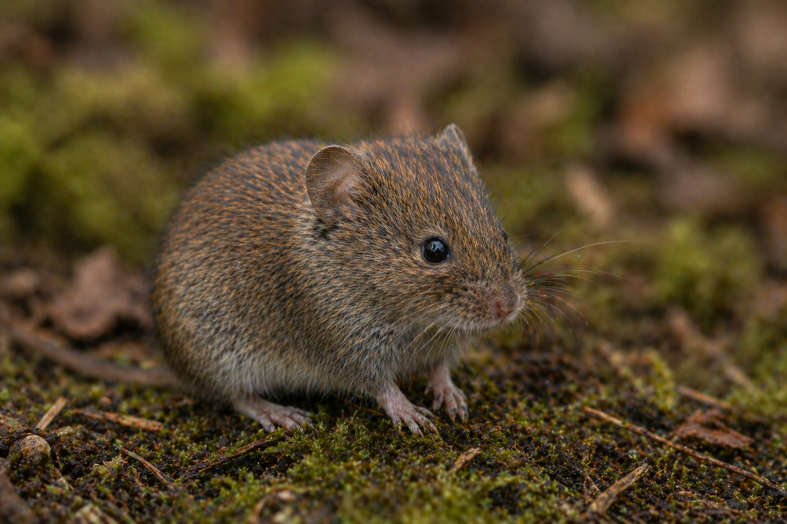

I am Jose, an environmental health researcher from Costa Rica with a background in Environmental Health and Integrated Coastal Zone Management. My work focuses on the links between contaminants, ecosystem health, and public health across aquatic and terrestrial environments. I am currently based in Prague, Czech Republic, where I continue developing research on ecotoxicology, environmental risk assessment, and wildlife bioindicators.

::::: columns
::: {.column width="60%"}

My research trajectory began during my undergraduate studies at the Center for Research in Environmental Contamination (CICA) at the University of Costa Rica, specifically in the Ecotoxicology Laboratory under the supervision of Dr. Carlos Rodríguez Rodríguez <a href="https://orcid.org/0000-0001-6923-7258" target="_blank" style="color:#6c757d; margin-left:4px; vertical-align:middle; display:inline-flex; align-items:center;" onmouseover="this.style.color='#A6CE39'" onmouseout="this.style.color='#6c757d'"><i class="fab fa-orcid" style="font-size:14px;"></i></a>. During this stage, I conducted my undergraduate thesis on the toxicity of emerging contaminants, particularly pharmaceuticals and antibiotics. My work focused on surface waters, hospital effluents, wastewater, and livestock-related water sources, as well as on the effects of binary mixtures of pharmaceuticals identified as posing high environmental risks. This research involved the use of bioindicator organisms such as *Daphnia magna*, *Aliivibrio fischeri*, microalgae, and *Lemna gibba*.

:::

::: {.column width="40%" .col-img-right}

{.about-img .img-right}

:::
:::::

::::: columns
::: {.column width="40%" .col-img-left}

{.about-img .img-left}

:::

::: {.column width="60%"}

Subsequently, I obtained a Master’s degree in Integrated Management of Tropical Coastal Areas, where I developed a project assessing anthropogenic impacts on three beaches in Costa Rica. This research evaluated water and sediment quality through an ecological approach that incorporated both biotic and abiotic variables in coastal ecosystems. The project was conducted at the Center for Research in Marine Sciences and Limnology (CIMAR), under the supervision of Dr. Eddy Gómez Ramírez <a href="https://orcid.org/0000-0002-8138-0222" target="_blank" style="color:#6c757d; margin-left:4px; vertical-align:middle; display:inline-flex; align-items:center;" onmouseover="this.style.color='#A6CE39'" onmouseout="this.style.color='#6c757d'"><i class="fab fa-orcid" style="font-size:14px;"></i></a>, and Dr. Jeffrey Sibaja Cordero <a href="https://orcid.org/0000-0001-5323-356X" target="_blank" style="color:#6c757d; margin-left:4px; vertical-align:middle; display:inline-flex; align-items:center;" onmouseover="this.style.color='#A6CE39'" onmouseout="this.style.color='#6c757d'"><i class="fab fa-orcid" style="font-size:14px;"></i></a>.

:::
:::::

::::: columns
::: {.column width="60%"}

In 2021, I began working as a researcher and lecturer at the University of Costa Rica, participating in projects at CICA and later at the Institute for Health Research (INISA), specifically in the Infection and Nutrition Section. In these roles, I have been involved in projects related to water quality, environmental microbiology, and antimicrobial resistance, including leading a research project evaluating coastal and continental water quality in Playa Jacó, Costa Rica.

:::

::: {.column width="40%" .col-img-right}

{.about-img .img-right}

:::
:::::

::::: columns
::: {.column width="40%" .col-img-left}

{.about-img .img-left}

:::

::: {.column width="60%"}

While much of my research experience has focused on aquatic ecosystems, my current doctoral research is centered on terrestrial ecosystems, where I study the dynamics, distribution, and ecological effects of metal(loid) contaminants. My work integrates ecotoxicological and biogeochemical approaches to understand how contamination influences species-level responses, trophic interactions, and ecosystem functioning. In particular, I use small mammals as bioindicators to assess environmental health and to explore how pollution shapes biogeochemical niches and energy flow across terrestrial systems. This research is conducted under the supervision of Dr. Markéta Zárybnická <a href="https://orcid.org/" target="_blank" style="color:#6c757d; margin-left:4px; vertical-align:middle; display:inline-flex; align-items:center;" onmouseover="this.style.color='#A6CE39'" onmouseout="this.style.color='#6c757d'"><i class="fab fa-orcid" style="font-size:14px;"></i></a>.

:::
:::::

---

Alongside my research activities, I have teaching experience at both undergraduate and graduate levels. My teaching includes courses in Environmental Health, Public Health, and Environmental Management at the University of Costa Rica and the University of Monterrey, as well as the supervision of undergraduate and graduate theses and professional internships.

For collaborations or academic inquiries, feel free to contact me at: jomontiel2602@gmail.com

Pura Vida

