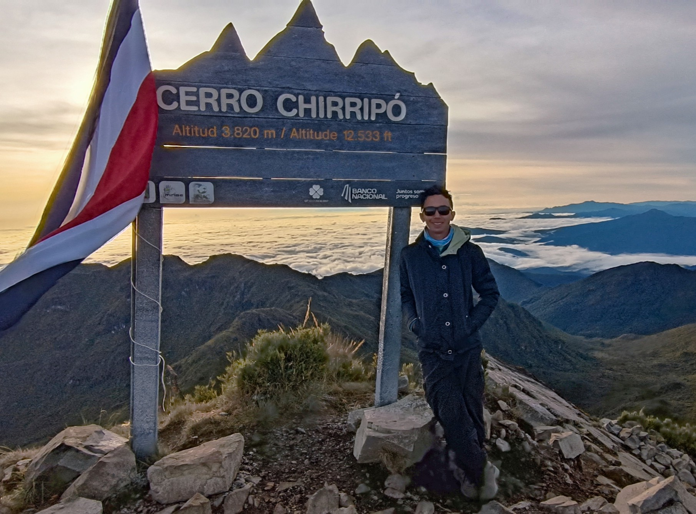

:::::: {.columns .home-columns}

:::: {.column width="35%"}

<h1 style="font-size:62px; line-height:1.05; font-weight:700; letter-spacing:-1px; color:#5A332C; margin-bottom:24px;">
José R. Montiel-Mora
</h1>

<a href="https://orcid.org/0000-0001-5581-1087" target="_blank"
style="color:#6c757d; text-decoration:none;" onmouseover="this.style.color='#A6CE39'" onmouseout="this.style.color='#6c757d'"><i class="fab fa-orcid"></i></a>

<a href="https://scholar.google.com/citations?user=Fltmg4QAAAAJ" target="_blank"
style="color:#6c757d; text-decoration:none;" onmouseover="this.style.color='#4285F4'" onmouseout="this.style.color='#6c757d'"><i class="fas fa-graduation-cap"></i></a>

<a href="https://www.researchgate.net/profile/Jose-R-Montiel-Mora/research" target="_blank"
style="color:#6c757d; text-decoration:none;" onmouseover="this.style.color='#00CCBB'" onmouseout="this.style.color='#6c757d'"><i class="fab fa-researchgate"></i></a>

<a href="https://www.webofscience.com/wos/author/record/HGB-3268-2022" target="_blank"
style="color:#6c757d; text-decoration:none;" onmouseover="this.style.color='#d9534f'" onmouseout="this.style.color='#6c757d'"><i class="fas fa-book-open"></i></a>

<a href="mailto:jomontiel2602@gmail.com"
style="color:#6c757d; text-decoration:none;" onmouseover="this.style.color='#000'" onmouseout="this.style.color='#6c757d'"><i class="fas fa-envelope"></i></a>

I work as an environmental health researcher interested in how contaminants move through ecosystems and affect environmental and public health. My work integrates ecology, ecotoxicology, water quality, coastal management, and wildlife bioindicators across aquatic and terrestrial environments. I also teach and mentor students in environmental science and research.

::::

:::: {.column width="65%"}

::::

::::::